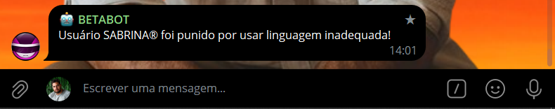
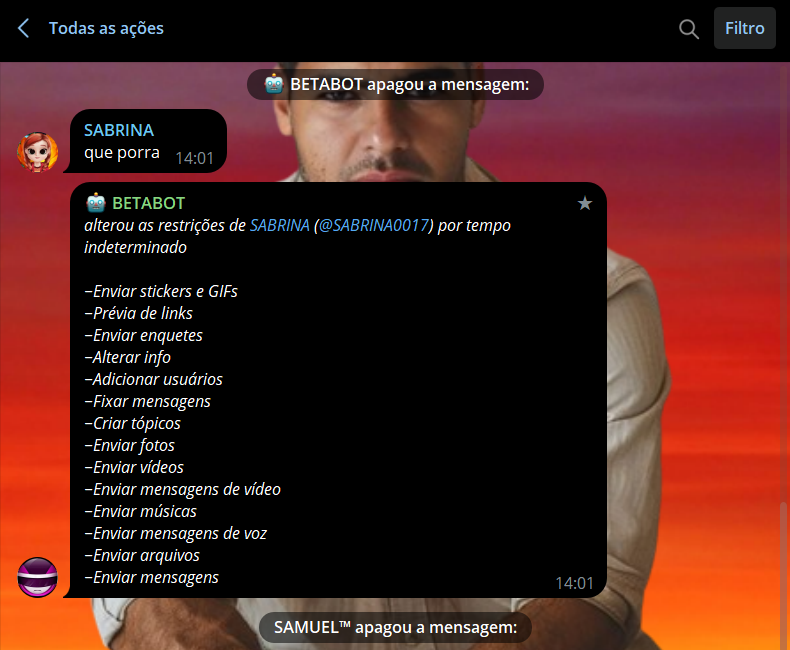

# MODERADOR ANTIPALAVRAO
👮‍♂️ESSE É UM BOT DO TELEGRAM QUE PENALISA OS MEMBROS QUE ENVIAREM PALAVRÕES!

 <br>
 <br>

## DESCRIÇÃO:
Este bot de Telegram, chamado "Bot Antipalavrão", é um moderador de grupos que detecta e pune usuários que utilizam palavras proibidas. Ele verifica mensagens enviadas em grupos, e se alguma palavra da lista proibida for detectada, o bot aplica uma penalidade ao usuário, como deletar a mensagem, mutar, kickar ou banir o usuário, conforme configurado.

## FUNCIONALIDADES:
1. **Comando `/start`**:
   - Quando o usuário envia `/start`, o bot responde com uma mensagem de boas-vindas e informa seu propósito.
   - Em grupos, o bot verifica se o usuário que enviou o comando é um administrador e responde de acordo.

2. **Detecção de Palavrões**:
   - O bot verifica todas as mensagens enviadas no grupo.
   - Se uma mensagem contém uma palavra proibida, o bot deleta a mensagem e aplica a penalidade configurada ao usuário.

3. **Penalidades Configuráveis**:
   - As penalidades podem ser configuradas no arquivo `CONFIG.json`. As opções incluem:
     - `ban`: Banir o usuário do grupo.
     - `mute`: Silenciar o usuário no grupo.
     - `kick`: Expulsar o usuário do grupo.
     - `off`: Nenhuma ação adicional além de deletar a mensagem.

## EXECUTANDO O PROJETO:
1. **Coloque o Token:**
   - Antes de executar o bot, é necessário substituir o token do seu bot no arquivo `TOKEN.py`, o qual pode ser obtido por meio do [@BotFather](https://t.me/BotFather).

2. **Instalando as dependências:**
   - Antes de executar o bot, certifique-se de instalar todas as dependências necessárias. No terminal, execute o seguinte comando para instalar as dependências listadas no arquivo `requirements.txt` em `CODIGO`:
   ```bash
   pip install -r requirements.txt
   ```

3. **Inicie o Bot:**
   - Execute o bot do Telegram em Python iniciando-o com o seguinte comando:
   ```bash
   python CODIGO.py
   ```

   - Procure pelo nome do bot (definido quando você criou o bot com o BotFather) e clique em "Start" ou envie o comando `/start`.
   - No chat privado, o bot responde com "Olá! Sou um bot moderador de grupos."
   - No grupo, o bot verifica se o usuário que enviou o comando é administrador e responde "VOCÊ É ADM" ou "VOCÊ NÃO É ADM" conforme o caso.

4. **Modere o Grupo**:
   - Adicione o bot ao seu grupo e dê a ele permissões de administrador para que ele possa deletar mensagens e aplicar penalidades.
   - O bot começará a monitorar as mensagens automaticamente.

## ARQUIVO `PALAVRAS.txt`:
- Um arquivo de texto contendo uma lista de palavras proibidas, uma por linha.
- Exemplo de conteúdo:
   ```
   palavrão1
   palavrão2
   palavrão3
   ```

## ARQUIVO `CONFIG.json`:
O arquivo `CONFIG.json` define a punição universal que será aplicada a qualquer usuário que enviar palavrões no grupo. Aqui está um exemplo de como o arquivo deve ser estruturado:

```json
{
   "punishment": "mute"
}
```

Para personalizar a punição aplicada pelo bot, edite o valor do campo `punishment` no arquivo `CONFIG.json`. As opções disponíveis são:

- `"ban"`: Para expulsar o usuário do grupo.
- `"mute"`: Para silenciar o usuário no grupo.
- `"kick"`: Para remover o usuário do grupo, permitindo que ele volte.
- `"off"`: Para não aplicar nenhuma punição.

## NÃO SABE?
- Entendemos que para manipular arquivos em muitas linguagens e tecnologias relacionadas, é necessário possuir conhecimento nessas áreas. Para auxiliar nesse aprendizado, oferecemos alguns subsidios:
* [CURSO DE PYTHON](https://github.com/VILHALVA/CURSO-DE-PYTHON)
* [CURSO DE TELEBOT](https://github.com/VILHALVA/CURSO-DE-TELEBOT)
* [CURSO DE JSON](https://github.com/VILHALVA/CURSO-DE-JSON)
* [CONFIRA MAIS CURSOS](https://github.com/VILHALVA?tab=repositories&q=+topic:CURSO)

## CREDITOS:
- [PROJETO BASEADO NO "MODERADOR ANTISPAM"](https://github.com/VILHALVA/MODERADOR-ANTISPAM)
- [PROJETO FEITO PELO VILHALVA](https://github.com/VILHALVA)
